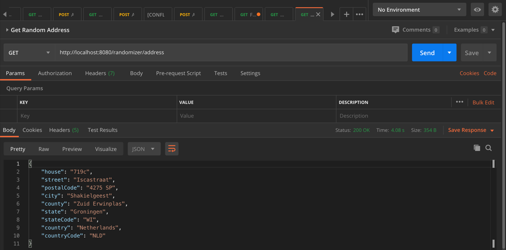

## address-randomizer-service

## Description
This is a Rest API service built using Java/spring boots that generates random address data for testing. The service generates random addresses for the following four countries, but can be easily extended to generate addresses for any locale/country.

1. *US*
1. *Canada*
1. *Mexico* 
1. *Netherlands*


## Installation:

1. Clone the repository from github using
   ```git clone git@github.com:bhapand/address-randomizer-service.git```
   
1. Run the application:
   a. Using maven (from the root folder)
   ```mvn spring-boot:run```
   
   b. Using java -jar command (should have the jar created, use ```mvn package```)
   ```java -jar target/address-randomizer-service-0.0.1-SNAPSHOT.jar```
   
1. By default the application runs on the default port *8080*, it can be changed at ```src/main/resources/application.properties``` by changing the value of ```server.port```


## Visuals
Using a tool like Postman or any browser a GET request can be made to the end point /randomizer/address.
The response should be in the following format:





Video:
